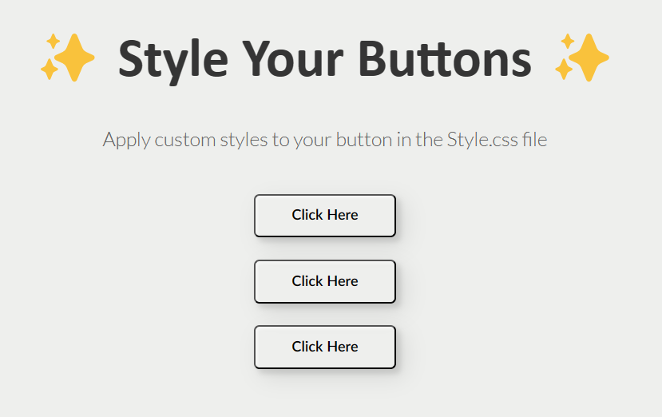

# [SDF04] CSS Magic Buttons

Get ready to create animated buttons using CSS! This project focuses on creating three unique animated buttons using CSS. With this challenge, you'll dive into the world of CSS animations, transitions, and interactivity.

## Learning Goals
By completing this project, you will learn to:
- Design engaging button animations with CSS.
- Master the use of CSS transitions and animations for interactive effects.
- Customize button designs by drawing inspiration from examples and implementing your unique style.



## Project Overview

### Time Estimate: 2 hours

### Your Task
1. **Choose Your Animations**: Select three button animations from our Codepen reference as inspiration: [View Reference](https://codepen.io/codespace-academy/pen/xxmWrjX).

2. **Implement Your Designs**: While the reference provides ideas, the goal is to create your animations from scratch. This practice enhances creativity and problem-solving skills.

3. **Starter Code**: Clone the starter code from GitHub for your project. The HTML structure is provided, and you'll focus on adding styles in the `style.css` file.
    - Starter code can be found here: https://github.com/CodeSpace-Academy/Module_4_StudentNo_Classcode_Group_Name-Surname_SDF04

    **HTML Structure**: 
    ```html
    <h1>✨ Style Your Buttons ✨</h1>
    <p>Apply custom styles to your button in the Style.css file</p>
    <button class="custom-btn btn-1">Click Here</button>
    <button class="custom-btn btn-2">Click Here</button>
    <button class="custom-btn btn-3">Click Here</button>
    ```

    **CSS Starter**: 
    ```css
    /* Basic styles are set. Add your custom styles for btn-1, btn-2, and btn-3 */
    ```

4. **Design Your Buttons**:
   - Focus on CSS for animations and transitions, especially hover effects.
   - Aim for a cohesive and appealing design for all three buttons.
   - Comment your CSS code to explain your design decisions and any challenges you faced.

## Submission Guidelines
- Submit the link to your GitHub repository on the LMS under the SDF04 project tab.

Embark on this CSS journey to transform simple buttons into interactive, animated elements. Let your creativity shine and enjoy the process of bringing static elements to life!
